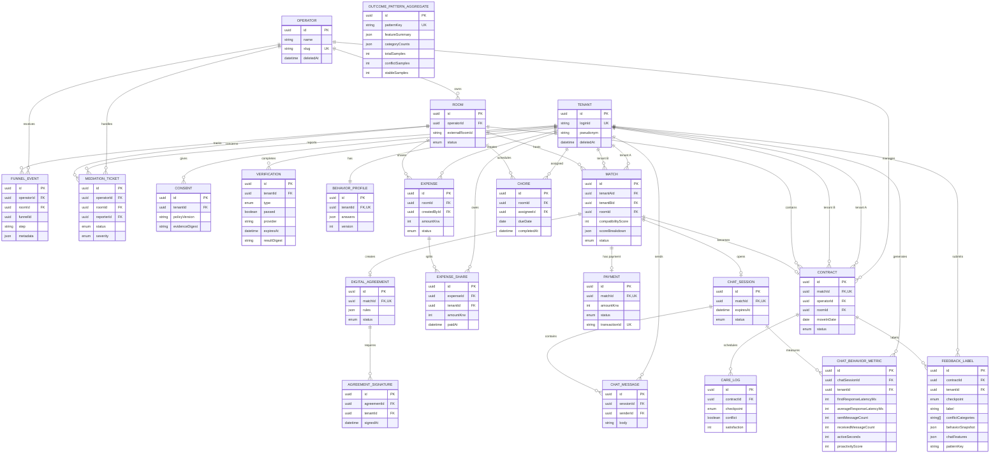

# CheckMate ERD

```mermaid
erDiagram
  OPERATOR ||--o{ ROOM : owns
  OPERATOR ||--o{ CONTRACT : manages
  OPERATOR ||--o{ FUNNEL_EVENT : receives
  OPERATOR ||--o{ MEDIATION_TICKET : handles

  TENANT ||--o{ CONSENT : gives
  TENANT ||--o{ VERIFICATION : completes
  TENANT ||--|| BEHAVIOR_PROFILE : has
  TENANT ||--o{ MATCH : "tenant A"
  TENANT ||--o{ MATCH : "tenant B"
  TENANT ||--o{ CONTRACT : "tenant A"
  TENANT ||--o{ CONTRACT : "tenant B"
  TENANT ||--o{ CHAT_MESSAGE : sends
  TENANT ||--o{ CHAT_BEHAVIOR_METRIC : generates
  TENANT ||--o{ MEDIATION_TICKET : reports
  TENANT ||--o{ EXPENSE : creates
  TENANT ||--o{ EXPENSE_SHARE : owes
  TENANT ||--o{ CHORE : assigned
  TENANT ||--o{ FEEDBACK_LABEL : submits

  ROOM ||--o{ MATCH : hosts
  ROOM ||--o{ CONTRACT : contains
  ROOM ||--o{ FUNNEL_EVENT : tracks
  ROOM ||--o{ MEDIATION_TICKET : concerns
  ROOM ||--o{ EXPENSE : shares
  ROOM ||--o{ CHORE : schedules

  MATCH ||--o| PAYMENT : "has payment"
  MATCH ||--o| CONTRACT : becomes
  MATCH ||--o| CHAT_SESSION : opens
  MATCH ||--o| DIGITAL_AGREEMENT : creates

  CONTRACT ||--o{ CARE_LOG : schedules
  CONTRACT ||--o{ FEEDBACK_LABEL : labels
  DIGITAL_AGREEMENT ||--o{ AGREEMENT_SIGNATURE : requires
  CHAT_SESSION ||--o{ CHAT_MESSAGE : contains
  CHAT_SESSION ||--o{ CHAT_BEHAVIOR_METRIC : measures
  EXPENSE ||--o{ EXPENSE_SHARE : splits

  OPERATOR {
    uuid id PK
    string name
    string slug UK
    datetime deletedAt
  }
  TENANT {
    uuid id PK
    string loginId UK
    string pseudonym
    datetime deletedAt
  }
  ROOM {
    uuid id PK
    uuid operatorId FK
    string externalRoomId
    enum status
  }
  VERIFICATION {
    uuid id PK
    uuid tenantId FK
    enum type
    boolean passed
    string provider
    datetime expiresAt
    string resultDigest
  }
  BEHAVIOR_PROFILE {
    uuid id PK
    uuid tenantId FK,UK
    json answers
    int version
  }
  MATCH {
    uuid id PK
    uuid tenantAId FK
    uuid tenantBId FK
    uuid roomId FK
    int compatibilityScore
    json scoreBreakdown
    enum status
  }
  PAYMENT {
    uuid id PK
    uuid matchId FK,UK
    int amountKrw
    enum status
    string transactionId UK
  }
  CONTRACT {
    uuid id PK
    uuid matchId FK,UK
    uuid operatorId FK
    uuid roomId FK
    date moveInDate
    enum status
  }
  CARE_LOG {
    uuid id PK
    uuid contractId FK
    enum checkpoint
    boolean conflict
    int satisfaction
  }
  DIGITAL_AGREEMENT {
    uuid id PK
    uuid matchId FK,UK
    json rules
    enum status
  }
  AGREEMENT_SIGNATURE {
    uuid id PK
    uuid agreementId FK
    uuid tenantId FK
    datetime signedAt
  }
  CHAT_SESSION {
    uuid id PK
    uuid matchId FK,UK
    datetime expiresAt
    enum status
  }
  CHAT_MESSAGE {
    uuid id PK
    uuid sessionId FK
    uuid senderId FK
    string body
  }
  MEDIATION_TICKET {
    uuid id PK
    uuid operatorId FK
    uuid roomId FK
    uuid reporterId FK
    enum status
    enum severity
  }
  EXPENSE {
    uuid id PK
    uuid roomId FK
    uuid createdById FK
    int amountKrw
    enum status
  }
  EXPENSE_SHARE {
    uuid id PK
    uuid expenseId FK
    uuid tenantId FK
    int amountKrw
    datetime paidAt
  }
  CHORE {
    uuid id PK
    uuid roomId FK
    uuid assigneeId FK
    date dueDate
    datetime completedAt
  }
  FUNNEL_EVENT {
    uuid id PK
    uuid operatorId FK
    uuid roomId FK
    uuid funnelId
    string step
    json metadata
  }
  CONSENT {
    uuid id PK
    uuid tenantId FK
    string policyVersion
    string evidenceDigest
  }
  FEEDBACK_LABEL {
    uuid id PK
    uuid contractId FK
    uuid tenantId FK
    enum checkpoint
    string label
    string[] conflictCategories
    json behaviorSnapshot
    json chatFeatures
    string patternKey
  }
  CHAT_BEHAVIOR_METRIC {
    uuid id PK
    uuid chatSessionId FK
    uuid tenantId FK
    int firstResponseLatencyMs
    int averageResponseLatencyMs
    int sentMessageCount
    int receivedMessageCount
    int activeSeconds
    int proactivityScore
  }
  OUTCOME_PATTERN_AGGREGATE {
    uuid id PK
    string patternKey UK
    json featureSummary
    json categoryCounts
    int totalSamples
    int conflictSamples
    int stableSamples
  }
```

`TENANT`와 `OPERATOR`는 인증·권한 경계를 분리한 독립 엔터티입니다. 모든 PK는 UUID이며, 핵심 테이블은 `deletedAt` 기반 soft delete를 사용합니다.
